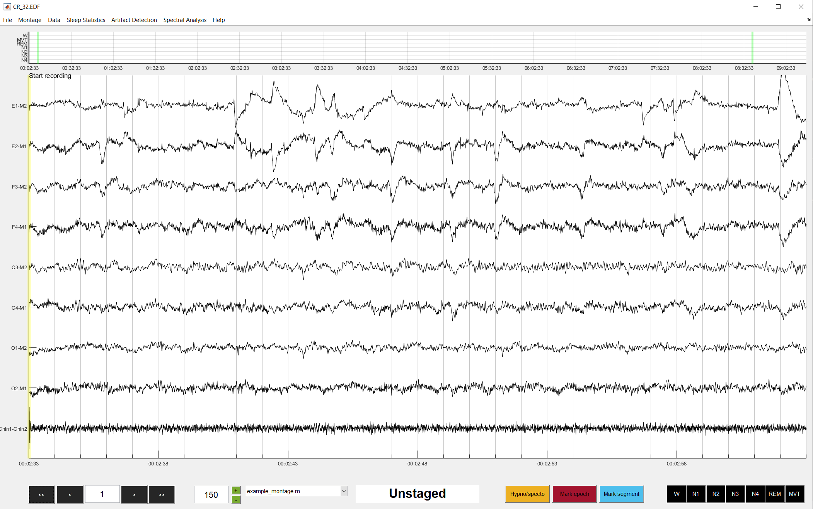

# Loading data

To load data into danalyzer, navigate to File → Load data or press CTRL + O (CMD + O on a Mac). This will bring up a window giving you the options to load various types of data. Either type the directory or use the push buttons to navigate to the file you wish to load. sleepDanalyzer can load the following types of file:

## Load dataset

Load in an EEG/PSG file. Currently, danalyzer can load data in any of the following formats: 
- .edf
- .vhdr (BrainVision header file)
- .set (EEGLAB native format)

For any of these to work, EEGLAB must be installed. In addition, the Biosig extension for EEGLAB is required for .edf files, and the bva-io extenstion is required for .vhdr files.

danalyzer can also load data stored as a .mat file, providing that the .mat is a formatted *psg* structure. Read more about file formats here.

## Load sleep stages

Load an existing score file that has been scored using danalyzer. Learn more about danalyzer score file format here, and information on how to export score files in different formats here.

## Load events

An events file, sometimes called a notations or annotations file. This file contains key events that happened during the recording (e.g. lights off/on times, biocalibrations etc.). Event files are tables (can either be a MATLAB table or spreadsheet (.xlsx or .csv)). The table must contain two columns. Column 1 is the clock time of the event, and column 2 is the event label. Note that danalyzer can also import BrainVision event files (.vmrk) that have their own organization structure.

## Load ar

Load an existing artifact rejection file that has been created using danalyzer. Read here for information on the format of danalyzer ar files.

After selecting the files you wish to load, click OK to read in the data (this may take a while depending on the size of the data file). When all of the data has been loaded, a new window will appear. Carefully review this window before you start scoring. The recording start time, lights off time, and lights on time fields will be automatically filled if a correctly formatted events file was loaded. If you don’t have an events file, the recording start time will be pulled from the dataset, and lights off and lights on time can be entered manually. All times should be entered in the format: **hh:mm:ss.sss**. *If lights off/on times are not specified, fanalyzer will assume that lights off was at the start of the dataset, and lights on was at the end of the recording*. The epoch length field specifies the epoch epoch size you wish to use for scoring, and defaults to 30 seconds. You can produce a spectogram on a specific channel by entering the name of the channel in the spectogram field. Use the scorer initial field to identify the individual who scored the record. 

When everything is entered correctly, click Confirm to pull the data into the GUI. If you have asked for a spectogram, it will take some time to complete. If everything went well, your data will appear something like this:

