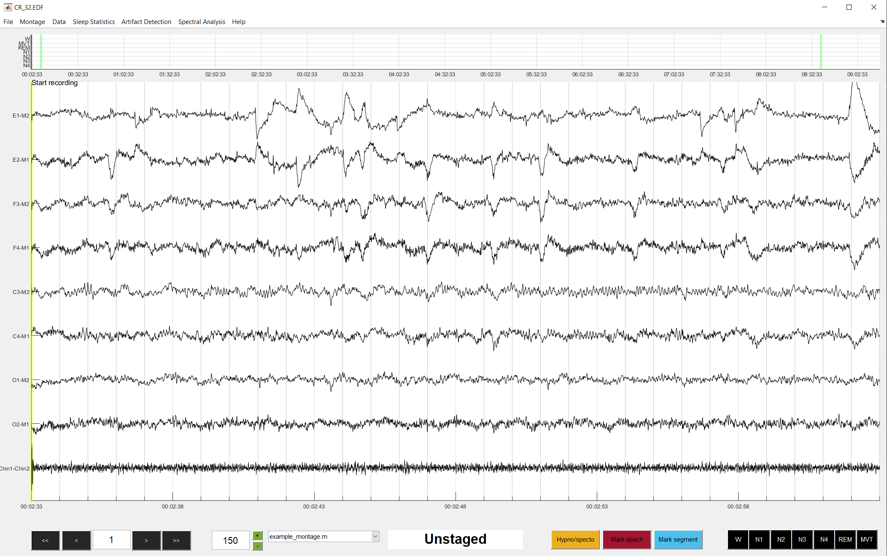

# danalyzer GUI quickstart

This brief tutorial will show you how to quickly start scoring data. This assumes you have a file ready to be sleep scored.
## Open danalyzer


With sleepDanalyzer downloaded and added to the MATLAB path, start the GUI by typing:

```matlab
sleepDanalyzer
```

into the MATLAB command window. This will print some text to the command window. If everything has been installed correctly, you should see something like this:

```matlab
Starting sleepDanalyzer version: 0.9.0

NOTE: This is a beta version of sleepDanalyzer!!!
Features still in development

Welcome to sleepDanalyzer!
```
The GUI relies on a number of EEGLAB functions to help import data of different types. If sleepDanalyzer cannot find these import functions, you will get a warning e.g.:

```matlab
Warning: BIOSIG extension for EEGLAB not found. Will not be able to import .edf files
```
If you get a warning like this, check your EEGLAB installation and ensure that 1) EEGLAB is on the MATLAB path, and 2) the relevant EEGlAB extensions are installed (BIOSIG extension required for .edf files, and BVA-IO extension required for BrainVision files).

If all has gone well, a blank GUI will have opened.


## Load data

To load data into danalyzer, navigate to File --> Load data or press CTRL + O (CMD + O on a Mac). In the window that opens, we are going to **Load dataset**. Either type the directory or use the push butons to navigate to the file that you wish to load. After selecting the file, click OK to read in the data (this may take a while depending on the size of the data file). When the data is loaded, a new window will appear. Carefully review this window *before* you start scoring. The recording start time is pulled from the dataset. If you have them, enter the lights off and on time. All times should be entered in the format: hh:mm:ss.sss. *If lights off/on times are not specified, danalyzer will assume that lights off was at the start of recording, and lights on was at the end of the recording*. Keep the epoch length field at the default 30 seconds.

When everything is entered correctly, click Confirm to pull the data into the GUI. If everything went well, your data will appear something like this:



## Apply a montage

You will likely want to change some details about how the data look for the purposes of sleep scoring (for example, adding a scale line). All of these alterations are controlled though a montage file, a MATLAB script that controls how the data are presented. To select a montage, click on the montage list and select which montage you want to use.

When a particular montage is selected, the display will update accordingly:


*In this example, applying the montage added scale lines around channel F3. It also re-colored EOG and EMG channels blue and red respectively.*

### Editing a montage

You can edit the motnage on-the-fly by navigating to Montage --> Edit montage (or by pressing the m key), which brings up a dialog window. You can specify any of the following changes:

- **Scale**: Integer specifying a new scale for all channels
- **Scale channel**: The channel that you wish the scale lines to be displayed around. Leaving this blank will remove the scale lines entirely
- **Scale values**: A value indicating where to place each scale line
- **Scale color**: A MATLAB RGB triplety indicating the color of the scale lines
- **Hide channels**: A list of channels you want to hide (i.e. remove from the display)
- **Channel order**: The order in which the channels are displayed. If you specify channels to hide, ensure that they are not listed in the channel order
- **EEG color**: The color of all EEG channels
- **EOG color**: The color of all EOG channels
- **EMG color**: The color of all EMG channels
- **ECG color**: The color of all ECG channels
- **Other color**: The color of all other channels

Click OK to adopt these new settings. You can always revert back to a predefined montage by selecting it from the montage list. You can also clear the montage entirely by navigating to Montage --> Clear montage.

!!!tip
	Rather than making on-the-fly changes each time, the best approach is to create a new montage file and add it to the list of available montages. See the Montage creation guide for full details.

When you are happy with your montage settings, we can begin browsing the data and start sleep scoring!

## Data browsing and sleep scoring

**Before you can interact with the GUI, you must click in an empty gray area of the GUI**.

Navigate between epochs by pressing the left or right arrow key. You can jump forwards or backwards in chunks of 10 epochs by clicking the >> or << buttons. The current epoch number is displayed in the bottom left. You can type any epoch number into this box to immediately jump to it. You can also move to a specific epoch by clicking on the corresponding space in the hypnogram window at the top of the GUI.

The current scale of the data is indicated in the box next to the montage list (default is 150). The scale can be adjusted by typing a new scale value into the box, or using the +/- buttons to increase or decrease the scale in chunks of 25.

!!!tip
	Scale units in danalyzer are essentially aribtary. danalyzer assumes the data are stored in microvolts, but this may not always be the case. If your data are all flat lines, one reason could be that the data are not microvolts.

Sleep scoring is incredibly straightforward. Score an epoch simply by pressing the corresponding button on the keyboard:

0 = Wake 1 = N1 2 = N2 3 = N3 4 = N4 5 = REM 6 = Movement

After scoring an epoch, the display will automatically advance. If you wish to unstage an epoch, press the period (.) key. As you score, you will see that the hypnogram also starts to be created. If you want to make any notes about the record that you are scoring, press the n key to bring up the Notes window. Here you can record any details about the record, and these notes will be saved alongside the score file.

## Saving sleep scores

When you have finished scoring a record, you will want to save the sleep scores. To save data, navigate to File --> Savd data or press CTRL/CMD + S to bring up the Save dialogue. As with loading data, danalyzer can also save many different kinds of data. 

To save sleep scores, type the directory or click the push button next to "Save sleep scores" (second row). If you use the push button, this will let you select a destination and name for the sleep scores. Navigate to the folder you wish to save to, and give the file a name. Then click save **NOTE: YOUR DATA HAVE NOT SAVED YET**. Then, in danalyzer, click the freen Save button to actually save your data. 

To verify that the scores have been saved, check that a .mat file has indeed appeared in the folder that you specified. There is nothing worse than not correctly saving your data after spending all that time sleep scoring!

!!!tip
	Full documentation about the format of danalyzer files can be found here. If you need to import/export to other types of file, see here.

You should now be at a point where you know how to load a dataset, apply a montage, and be comfortable with using danalyzer to sleep score. To learn more about the full functionality, see the relevant pages in the Reference tab on the sidebar. Happy sleep scoring!