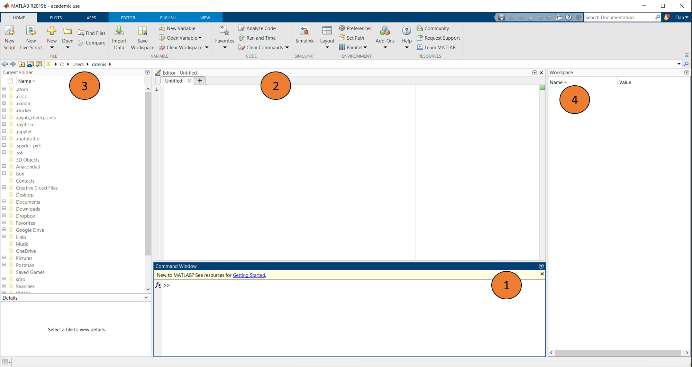
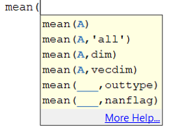
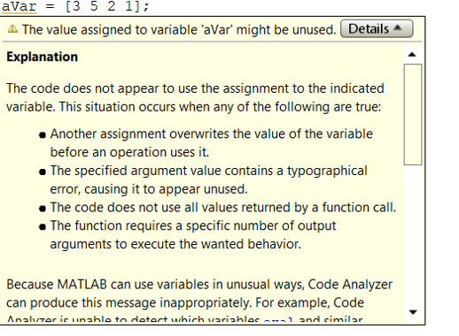
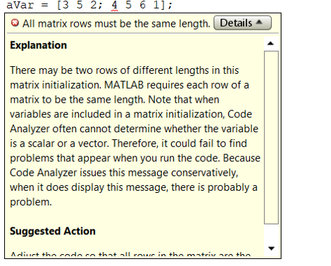
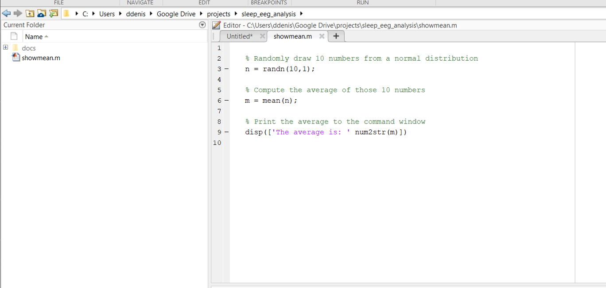
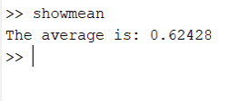
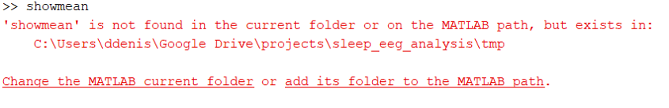

# The MATLAB environment

## The MATLAB GUI

When you open MATLAB, you will see something similar the image below:



This is the MATLAB graphical user interface, or GUI. All of the programming and running of code we will do will happen in this GUI. 

The GUI sometimes changes a little between versions. MATLAB releases two versions each year (an a and a b version). Differences tend to be minor, and you can usually run older code on a newer version of MATLAB. The reverse is often true as well, although newer functions won’t be available in older versions. Everything we will be working with was written in 2016b and should work in all newer versions. 

You will see a series of different windows available to you:

1. **Command window**: This is where you can interact with MATLAB. All code gets evaluated in the command window

2. **Edtior:** This is where you view and edit MATLAB scripts or functions. All of your code will be evaulated here. If you don't have an editor window, you can open one by typing *edit* into the command window.

3. **Current folder:** This shows your current working directory, all files in that directory, and the subdirectories.

4. **Workspace:** This windows shows all the variables stored in the memory buffer for the current session, and will provide some information about each variable.

The layout can be heavily customized. In the Home tab, you can go to Layout to edit the layout and reset to the default. By accessing Preferences you can customize almost everything about your MATLAB experience such a color scheme, keyboard shortcuts etc.

## Evaluating code

All code is evaluated in the Command Window. You can type directly into the command window or copy-paste, but most of the time you are going to use scripts. Scripts are text files that can be opened by MATLAB (with the extension.m). Just having code in the Editor will not make it run. To make it run we need to evaluate it in the command window. There are multiple ways to do this, but the most convienent are:

1. Highlight the line(s) you want to run, right click, and select *Evaluate selection*
2. Highlight and press F9 (if on a PC. All shortcuts can be changed in preferences)
3. With the editor active, press CTRL + ENTER
4. Save the script in the current directory, then type the name of the script into the command window

## MATLAB files types

There are several MATLAB file types that you should be aware of:

1. **.m:** These are MATLAB script files that contain code
2. **.mat:** These are MATLAB-readable datafiles that can be interacted with using the *save* and *load* commands. Of course these are not the only files MATLAB can read. We will talk more about importing/exporting different file types later one
3. **.fig:** These are MATLAB-readable figures. 
4. **.mex:** You will probably not interact much with MEX files. Essentially there are compiled code used to make things run faster.

## Keyboard shortcuts

There are lots of keyboard shortcuts that can be altered in the Preferences tab. Below are just a few of the more useful ones:

* **CTRL + ENTER:** Run all code in the editor/run the highlighted cell
* **Tab:** When you start typing in a function name, pressing tab will help complete it or give you a list of possible functions
* **CTRL + R:** Comment out an entire line
* **CTRL + T:** Uncomment a line
* **CTRL + I:** Smart indent. This is useful for helping to keep your code tidy. This wil lbe particularly useful when we look at control statements
* **CTRL + C:** If pressed when the command window is active, it will break the current code and return control to you. This is invaluable when you want to stop a very long process (e.g. if you realize you made an error!).
* **F9:** Run the highlighted line of code
* **F5:** Run the entire script
* **Up arrow:** In the command window, press the up arrow to search through and re-evaluate previous lines of code

## Getting help

Even the most seasoned MATLABer will spend considerable time accessing the help documentation. There are multiple ways to get help when using MATLAB. When calling a function, MATLAB will automatically provide hints about the input arguments it expects:



In this example, the function *mean* has been called, and MATLAB tries to help by reminding you about which arguments you need. Often you are going to need more information to understand what a function does and what the various inputs and outputs are. The *help* function will print any other function's help to the command window:

```matlab
help mean
```
This command will print the help file associated with the function mean. The MATLAB website also contains fairly useful documentation. When you run into situations you cannot solve, searching for your problem will often find you an answer. The MATLAB Central help forum is a good place to look for solutions to problems, as is StackExchange.

## Code analyzer

This is a built-in program that analyzes the code in the Editor window and looks for problems. A warning is given when the code analyzer detects code that will work but could be problematic in some circumstances. The part of the code giving the warning is highlighted by an orange squiggly line, and holding the cursor over the warning will give information about why MATLAB has thrown a warning:

{: style="height:300px"}

You do not necessarily need to fix all of the warnings, as the code will still run. However it is good practice to inspect each warning, consider why it is warning you, and if it needes to remedied.

An error is given when it finds a line that MATLAB will crash on. Before running a script, you will need to fix any errors that the code analyzer finds. A script will never run while there are errors present. An error is highlighted with a red squiggly line. Like with warnings, holding the cursor over the error will give you some information:

{: style="height:300px"}

Although useful, do not rely solely on the code analyzer. It will not pick up all errors. It will also not save you from the worst errors of all, which are times when the code does not crash, but gives you the wrong outcome!

## Comments and cells

When you are writing scripts, commenting is the second most important thing after the code itself. It serves as a reminder to you what each part of your script does, and will help others decipher what you are doing. Use the *%* symbol to write text as code:

```matlab

% This is a comment

this is not a comment
```

Within a script, typing *%%* will turn the script into a block or cell. You can evaluate individual cells by clicking into them and pressing CTRL + ENTER. Cells can also be a nice way to break up a long script into more manageable chunks. As we construct our own pipeline throughout the tools tutorial, we will sue cells to break the pipeline up into its main parts.

## Directories and paths

MATLAB is always ‘in’ a directory. The current folder displays the directory MATLAB is currently in. You can also get the current directory using the *pwd* function. You can change the current directory using the *cd* function. Type in folder one level up. You can also go back one level in the current directory by typing *cd ..*

The concept of the MATLAB path is a very important one, as it relates to where MATLAB looks for code. To understand how this works, consider the example below. We have written a small script (what it does does not matter much right now), and saved it in the working directory, and called it showmean:



If we type showmean into the Command Window, we get an output:

{: style="height:80px"}

Now we are going to create a new folder in the working directory called tmp, and move the showmean script into that new folder. That MATLAB code for that is:

```matlab

% Make a new folder
mkdir('tmp')
movefile('movefile.m', 'tmp/movefile.m')

```

After moving the file, we try to run showmean again. This time we get an error:



Why doeds this happen? It is because MATLAB cannot see all the files on your computer. It only knows about files that are on the MATLAB path. The current directory is always on the path. We can add and remove other locations as needed. In the GUI, you can adjust the MATLAB path by clicking on the Home tav, then clicking Set Path. We can also do this with the *addpath* and *rmpath* functions:

```matlab

% Add a folder to the path
addpath('path to add')

% Remove a folder to the path
rmpath('path to remove')

```

Let's use addpath to add the tmp folder to the path, and try running showmean again:

{: style="height:80px"}

Success! showmean ran because MATLAB now knows to look in the tmp folder. Whenever you start an analysis, it is important you know which directories are on the MATLAB path. It is common to use *addpath* at the top of a script to add the relevant directories needed for an analysis. Having too many directories permanently on the path can cause MATLAB to run slow. I keep frequently used toolboxes on the path permanently using a startup file.