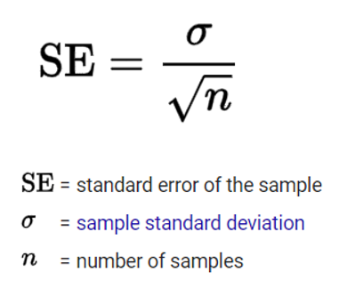

# Functions

We have already talked about using the Editor to write scripts. A function is essentially the same thing as a script, except it gets modified less often and works inside its own workspace. All functions have a name and most need to be supplied an input. In exchange, the function returns one or more outputs to you.

We have already seen several functions. For example, the function *mean* takes a set of numbers as an input, and gives you the average of those numbers as the output. In general, functions all follow the following syntax:

```matlab

output = functionname(input);

```
## Using functions

Let's try working with a few different functions. To do this, we will need to create some data to work with. The function *randn* will generate a matrix of random numbers drawn from a normal distribution for us:

```matlab

data = randn(25, 1);

```

Let us consider this line of code. The function name is *randn*. Then, inside the parentheses we provide our input arguments here. We are providing the function with two input arguments, with each input separated by a comma. In this case, the function will return a matrix with 25 rows and one column. By using the = sign, we are assigning that output to the variable named data. 

!!! tip
	Don't forget that if you need more information about what a function does or what input it needs, always try:

	```
	help functionname
	```

Ok now that we have our data, let's try using some more functions to get some information about the variable data. Remember, for each function we need to provide an input and assign a veraible to the output. In all these cases, we are going to use the variable *data* as our input:

```matlab

% Get the size of each dimension of the input. Very useful when debugging

sizeData = size(data);

% Find the minimum value of data

minData = min(data);

% Find the maximum value of data

maxData = max(data);

% Find the median of data

medData = max(data);

% Find the standard deviation of data

stdData = std(data);

```

## Multiple inputs and outputs

In the above examples, we gave each function one input, and returned a single output. This is not always the case however, and most functions can take more than one input argument, and can return more than one output. 

We already had an example of providing a function with two inputs when we generated our data, but let's look at another one. When we used the function *size*, the output gave us the size of each dimension. If we only wanted to know the size of say, the second dimension, we can do that by providing the dimension number as a second input to size:

```matlab

colSizeData = size(data, 2);

```

As well as multiple inputs, many functions can return multiple outputs as well. Multiple outputs are separated by commas and contained in square brackets. *max* is just one example of function with more than output:

```matlab

[val, idx] = max(data);

```

Here we have gotten two outputs from max. *val* is the same that we got when we ran *max* previously i.e. it is the value of the highest number in *data*. But what if you didn't want to know just what the maximum value is, but its position in the matrix? This is what the second output of max tells you. You can confirm that by entering *data* into the command window and manually checking the position of the largest value.

!!! question
	Try using your indexing skills to retrive the value of the higher number in data, using the idx output of the previous command.

## Inputs as outputs

The ouput of one function can be used as the input of another. This can save us space when writing code. For example, if we wanted to create a new variable of random numbers that is the same size as *data* we could write:

```matlab

sizeData = size(data);
data2 = randn(sizeData);

```

Alternatively, we could write:

```matlab

data2 = randn( size(data) );

```

Here the output of size is being directly fed into the input of randn. This means there is no need to create a new variable called *sizeData* and take up an extra line of code. While this approach is useful for writing consise code, some consideration are needed. First, you can only use the first output of a function as an input for another. If you wanted to use the second or third output of a function you would need to create an intermediate variable first. Second, it is possible to embed functions in this manner as many time as you want and need. For example:

```matlab

a = max(randn(size(data)));

```
Here we are now not only using the output of *size* as the input of *randn*, we are then taking the output of randn and feeding it to the input the of *max*. When reading code like this, remember that the operations are heppening from the inside out. The inner most function is being evalulated first, followed by the function immediately to its left, and so on. As you add more and more functions this way, keep readability in mind! If you are more than three variables deep, you might want to consider breaking the code up into multiple steps.

## Writing functions

Functions are just text files with a .m extension, the same as a script. In the command window type:

```matlab

edit mean

```

to open the function mean in the editor. You will notice right at the top of the file the main difference between how a script and a function is formatted. the word *function* right at the start is telling MATLAB this is a function. After that the output(s), function name, and input(s) are specified. All of the commented text underneath the function definition are what gets printed out when you type *help mean*. After that comes the function code itself.

You can write your own functions! Before you do, you should think about whether it is a good idea or not. Writing too many functions can cause problems with debugging, as it becomes harder and harder to figure out and remember what functions do, what variables are hard coded within functions etc. It also makes sharing code more difficult, because you will need to share all the functions you wrote in addition to your main script.

A good reason to create your own function is if you have pieces of code that you find yourself needing over and over again. Rather than copy-pasting that code each time, you could write a function that you save on your MATLAB path. As an example, when I am analyzing data I frequently need to create a list of folders that contain each participant's data. Here is the code to do that:

```matlab

startFolder = 'root folder';
subList     = dir(startFolder);
isItAFolder = [subList(:).isdir];
subList     = {subList(isItAfolder).name}';
subList(ismember(subList,{'.', '..'})) = [];

```

This is five lines of code that I was using in almost all of my analysis scripts. As such I decided to write my own function called *generatesublist*:

```matlab

function subList = generatesublist(startFolder)
% Generate a list of subject folders contained within startFolder

subList     = dir(startFolder);
isItAFolder = [subList(:).isdir];
subList     = {subList(isItAfolder).name}';
subList(ismember(subList,{'.', '..'})) = [];

```

This means now when I want to create a list of folders, I just need to write:

```matlab

% Create a list of participant folders

subList = generatesublist('root folder');

```

Much better! And by giving the function a helpful name and comment, it should be very clear to others what that custom function does.

## Create a function to calculate standard error

So let's try writing our own function. A common statistic we use in data analysis is the standard error. Unfortunately however MATLAB does not provide an in-built function to calculate standard error. So let's do it ourselves. First, here is the equation for calculating standard error:

{: align=centre style="height:200px" }

We want to write a MATLAB function to perform that equation on a variable:

```matlab

output = standarderror(input);

```

To start, we will open a new file in the editor. In the very first line we will specifiy this is a function, and then assign the function name, input, and output. You call these input and output variables whatever you like:

```matlab

function y = standarderror(x)

```

Underneath that, we are going to want to explain what our function does, so that when users type *help standarderror* they can understand how to use the function:

```matlab

% Compute the standard error on input data
%
% Required input:
%
% x = A 1D numeric variable
%
% Output:
%
% y = The standard error
%
% Code written by:<your name here>

```

Now save the file. The function file name should have the exact same name as the name of the function. Make sure you save it to the path. Now, try typing help standarderror into the command window. MATLAB should now print out the help file you just created.

Ok, so now we need to write the code itself. The first thing we need to do is to calculate the standard deviation of our input:

``` matlab

% Calculate the standard deviation

xSTD = std(x);

```

Now we need to find out how many 'samples' are in our input data. This will correspond to the number of elements of the variable. We can find the number of elements in the longest dimension by using the function length:

```matlab

% Length of the input

xLength = length(x);

```

Now we need to calculate the square root of the number of samples. Again, MATLAB has an in-built function for that:

```matlab

% Square root of the number of samples

xSQRT = sqrt(xLength);

```

So now we have calculated all of our component parts, we can perform the equation:

```matlab

% Calculate standard error

y = xSTD / xSQRT;

```

This is what the whole function looks like:

```matlab

function y = standarderror(x)
% Compute the standard error on input data
%
% Required input:
%
% x = A 1D numeric variable
%
% Output:
%
% y = The standard error
%
% Code written by:<your name here>

% Calculate the standard deviation

xSTD = std(x);

% Length of the input

xLength = length(x);

% Square root of the number of samples

xSQRT = sqrt(xLength);

% Calculate standard error

y = xSTD / xSQRT;

```

!!! question
	It took use four lines of code to calculate the standard error. Use your knowledge of inputs as outputs to shorten the function to just one line.


Save your function again, we are now going to try running it on the random data we generated earier:

```matlab

seData = standarderror(data);

```

!!! tip
	Take a look at your workspace. You will notice that none of the variables that we created in the function are in the workspace. This is because functions work within their own workspaces that cannot be accessed from the 'base' workspace. 

## Debugging

One last thing we need to know about functions is how to debug them. Debugging is an essential (and tedious) part of programming. Thankfully MATLAB provides some helpful debugging tools. If a function is broken, we will need to 'take a peek' inside the workings of that function to see what is wrong. Let's deliberately break our newly made standard error function:

```matlab

xSQRT = sqt(xLength);

```

!!! question
	Why does this break the code?


Save the function and run it again. Of course, we know this will cause can error. Take a look at the error message, it tells us which line of the function the error occurred on. So let's use some debugging tools to fix this problem. Make sure our function is open in the editor. You will see that for each line of code, there is a little horizontal line to the left of the code alongside the line number. These are parts of the code where a breakpoint can be inserted. Click on the horizontal line at line 24, the line which is causing the error. Now run the function again.

This time, the function pauses at the line you put the breakpoint in. Take a look at the workspace, now we are 'in' the function workspace. You can navigate between workspaces by using the Function Call Stack menu in the toolbar. Now we are in the function's workspace we can try to diagnose and fix the error with our function. Thankfully the error is easy to fix this time (and in reality you probably would even need to use the debugger). Nevertheless, the principle is the same when you come across an error in your functions. Make sure to remove the breakpoint by clicking it again before you try to use the function again!

!!! tip
	An important part about writing your own functions is that they should be generalizable to different situations and datasets. Think about how you could generalize *standarderror* to work on 2D matrics, and how could you add a second input argument to instruct the function as to which dimension to work along?