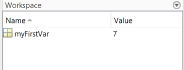

# Variables

Variables are how we can store pieces of information in MATLAB. Creating a variable in MATLAB is straightforward. You simply give your variable a name, and *assign* a value to that variable using the *=* symbol:

```matlab
myFirstVar = 7
```

If you type that line into the command window, MATLAB will confirm what you just wrote. Whenever you evaluate some code in MATLAB, it will confirm by printing the result to the command window. This can get annoying after a while, and is often unncessary. You tell MATLAB to shut it by placing a semi colon at the end of the line:

```matlab
myFirstVar = 7;
```

Now that you have created a variable, it appears in the Workspace. It tells you the name of the variable, as well as giving you some information about its content:

{: style="height:100px"}

To get more information about a variable we can use the function *whos*:

``` matlab
% Get information about a specific variable

whos myFirstVar

% Get information about all variables in the workspace

whos
```
This tells us the name of the variable, as well as important information about the size and class of the variable. These bints of info will make more sense as we learn about different types of variable:

```
  Name            Size            Bytes  Class     Attributes

  myFirstVar      1x1                 8  double  
```

You can reassign any value to an  existing variable in the exact same way you initially created the variable. To clear a variable from the workspace you can use the *clear* command. It is also possible to empty a variable, meaning that the variable itself will remain in the workspace but will not have any value assigned to it. Do this using the square brackets *[]*. We will learn why this is the case in the next section:

```matlab

% Reassign a new value to a variable

myFirstVar = 9;

% Empty a variable, but keep it in the workspace

myFirstVar = [];

% Clear the variable from the workspace

clear myFirstVar

```

## Variable naming

There are several rules and guidelines when it comes to naming variables. Here are the key rules:

* Variable names cannot contain spaces. Use an underscore (*_*) instead
* Variable names cannot start with numbers.
* Variable names cannot contain non-alphanumeric characters except the *_*

As as well as these hard rules (MATLAB will throw an error), there are also useful guidelines to follow. Others have attempted to write entire "[style guides](https://www.mathworks.com/matlabcentral/fileexchange/46056-matlab-style-guidelines-2-0)", but here are a few help suggestions:

* Don't use the same name as an existing function. If you do this, your variable will take precedence over the function which is very likely to lead to errors. For instance, if you name a variable *mean*, it will overwrite the MATLAB function *mean*. If you are unsure if a variable name might conflict with a function, you can use the *which* command to check.
* Use meaningful variables names, but try not to use variable names that are too long. Keeping variables short and meaningful leads to easier to read code.
* MATLAB is case-sensitive, so pay special attention to to capital letters. myVar, Myvar, and myvar would all be interpreted as different variables by MATLAB. 
* Be consistent. Keep pluralization consistent throughout a script. When you have variables that are 2+ words, separate words consistently e.g. by using snake_case or camelCase.

## Types of variables

We are going to briefly go through the major variable tpyes you are likely to come across while using MATLAB. As you gain more experience it wil lstart to become clearer when to use each type of variable.

### Numeric variables

The most common variable type we will come across. In fact, myFirstVar was a numeric variable. Variables for numbers can contains single numbers (called scalars) or multiple numbers. A one-dimensional matrix of numbers is called an array, and can be created using square brackets *[]*:

```matlab

anArray = [2 6 8 3]; 
```

!!! tip
	As well as using square brackets to create arrays/matrices, you can also use square brackets to joing existing variables together. This way of creating a variable is called *concatenation*:

	```
	var1 = [1 2 3];
	var2 = [4 5 6];
	var3 = [var1 var2];
	```


A two-dimensional matrix can be created by using the semi-colon to indicate where the next row begins:

```matlab

aMatrix = [2 6 8 3; 5 2 1 9];
```

What are the "dimensions" of this matrix. We can check by using *whos*

```matlab

whos aMatrix

```
``` matlab
  Name         Size            Bytes  Class     Attributes

  aMatrix      2x4                64  double              

```

The size output tells us this a 2x4 matrix. What this tells us is that the first dimension has a size of two, and the second dimension has a size of four. Whenever referring to dimensions of a MATLAB variable, the first dimensions is *always* referring to rows, and the second dimension columns. As such, we can determine that this matrix has two rows and four columns. While this seems obvious given that we assigned it ourselves, when you are working with much larger datasets you will need ways to quickly figure out a variables dimensions.

!!! question
	The size of a variable can be found using the *size* command:

	```
	size(aMatrix)
	```

	When you run this code, what does the output mean?

An important rule of matrices is that they have to be rectangular. Each row of a matrix must have the same number of elements. The error message *Dimensions of arrays being concatenated are not consistenet* will be displayed whenever you try to create a variable with differing number of elements.

Once you have created some variables, you can use them in mathematical expressions. Most mathematical operations in MATLAB have fairly intuiatve keys:

```matlab

% Create some variables

var1 = 6;
var2 = 8;

% Perform some mathematical operations

addVar = var1 + var2;
subVar = var1 - var2;
mulVar = var1 * var2;
divVar = var1 / var2;
powVar = var1 ^ 2;

```

You can perform the same operations on arrays and matrics in an element-wise fashion. This means that if you were to add two arrays together, the first element in array 1 would be added to the first element in array 2, and so on. Matrix algebra is an extensive subject in its own right, and you get a primer with MATLAB examples [here](https://www.mathworks.com/help/finance/matrix-algebra-refresher.html):

```matlab

% Create some arrays

arr1 = [1 2 4];
arr2 = [2 4 6];

% Perform some mathematical operations

addArr = arr1 + arr2;
subArr = arr1 - arr2;
mulArr = arr1 .* arr2;
rDivArr = arr1 ./ arr2; % Right array division (divide first array into second)
lDivArr = arr1 .\ arr2; % Left array division (divide second array into first)

```

### Logical variables

Also called Booleans. These are a sepcial type of variable that can assume either the state *true* (1) or *false* (0). We can create a logical variable by using a logical operator. The *==* sign is just one such case, and evalues whether two elements are equal to each other:

```matlab

% Does 1 = 1?

aLogical = 1 == 1;

% Does 1 not equal 1?

aLogical = 1 ~= 1;

% Is 1 greater than 2?

aLogical = 1 > 2;

% Is 1 less than 2?

aLogical = 1 < 2;

```

Hopefully you can figure out which cases the logical value will be true, and which cases the value will be false. You can also create logical variables with the *true* and *false* commands:

```matlab

% true

trueLogical = true;

% false

falseLogical = false;

```

A very common usage for logical variables is in *if* statements, which we will get to in a later section. Although logical variables have their own Class in MATLAB, they can also be treated as numeric variables in operations:

```matlab

aNumeric = 7;
aLogical = true;

aNumeric + aLogical

```
```matlab

ans =

     8

```

### Character and string variables

Characters can be stored as variables using single quotes:

```matlab

% A character array

aChar = 'matlab rules';

```

Unlike a variable name, spaces and non-alphanumeric characters are fine here. MATLAB stores characters according to their ASCII code. As such, adding together a numeric and character will give you unexpected results:

```matlab

num7  = 7;
char7 = '7';

num7 + char7

```
```matlab

ans =

    62

```

Clearly this is not the answer. Rather than adding 7 to 7, MATLAB is instead adding 55 to 7. This is because the ASCII code for the character '7' is 55. Use the str2num function to automatically convert a character to a number:

```matlab

num7 + str2num('7')

```
```matlab

ans =

    14

```

More recent versions of MATLAB have introduced a different class of variable, called a string. Functionally, a string array serves a similar purpose to a character array, except they are created using double quotation marks rather than single quotations:

```matlab

% A character array

aChar = 'matlab rules';

% A string array

aString = "matlab rules";

```

The distinction between a character and a string variable is quite subtle. Let's inspect both variables using *whos*:

```matlab

whos aChar aString

```
```matlab
  Name         Size            Bytes  Class     Attributes

  aChar        1x12               24  char                
  aString      1x1               166  string              

```

This tells us that the character array contains 12 elements, whereas the string array contains just a single element. This illustrates the fundamental difference between a character and string array. In a character array, each letter is an individual element that can be indexed (more on that next). A string array on the other hand contains all of the text inside a single element. In practice, for sleep EEG analysis we will not work too much with these kinds of arrays. However it is important to keep in mind the difference of single and double quotations when creating text-based variables.

### Cell variables

A cell variable allows us to store elements of different types, and can also be useful in storing data of different sizes. We have already seen what happens if we try and create a matrix of different size rows. We also run into problems when we try to store numeric and character variables:

```matlab

[6 'number' 8]

```

```matlab
ans =

    'number'
```
To deal with this, we use a cell array. You can think of a call array as containing a series of separate cages containing different pieces of information. A cell array can be created using curlu brackets *{}*:

```matlab

% Create a cell array

aCell = {6 'number' 6};

```

After creating a cell, you can access each element in the cell using indexing, which we will talk about in the next section.

!!! question
	Cell arrays can also be multidimensional. Try creating a 3 X 5 cell array with a mixture of numbers and characters. Using *whos* or *sizes* to verify.


Cells can also contains data of different sizes. Remember, in a matrix we cannot have rows with differing numbers of elements. In such a situation, our solution is to place each row of data into a separate "cage" inside a cell array:

```matlab

% Won't work as a matrix

a = [3 4 5; 5 7 3 1; 1 2];

% Will work in a cell array

c = {[3 4 5] [5 7 3 1] [1 2]};

```
```matlab
c =

  1×3 cell array

    {1×3 double}    {1×4 double}    {1×2 double}

```

If we look at the contents of the cell we have just created, we can see our cell array has one cell for each of our differently-lengthed arrays. MATLAB does not throw an error here, because each array is self-contained in its own part of the cell.


### Structures

Structures are another useful way for storing lots of different types of data. They can be thought of as a small database. Each property of a structure is called a field and is defined using thr period key:

```matlab

% Create a structure

aStruct.field1 = 3;
aStruct.field2 = 'hello';

```

If you were to inspect the size of this varialbe, you will see it is a 1x1 variable. Although this might be confusing (afterall, we have created 2 fields). The reason for this is that although there are only two fields, there is only one instance of the variable *aStruct*. We can add a second entry to the variable:

```matlab

% Add a new entry to the structure

aStruct(2).field1 = 8;
aStruct(2).field2 = 'hello';

```

As we start working with real data, we are going to come across structures alot. When EEG data is loaded into MATLAB it is stored a structure. Similarily, output from most of the analysis functions (e.g. spindle detection) will be formatted as a structure. As such it is well worth spending some time familiarizing yourself how to access data in a structure. We will discuss ways to access data in a structure in the next section.

### Tables

Tables can be used to stroed data like a spreadsheet, with each column having a title. Like cells and structures, tables can store different data types. The *table* function creates a table:

```matlab

% Create a table

aTable = table("ppt_01", 6.5, 30, 'VariableNames', {'subid', 'spindles', 'memory'});

```

Here we are first assigning values to each column in the table. This example, which is similar to how you might use a table in real data, is assigning three columns. Column 1 is a string indicating a participant id. Columns 2 and 3 will be numeric data, indicating this participant's spindle density and memory score. After assigning all the data we want, we then need to specify the names of each of our columns. We do this with the *input argument* 'VariableNames', followed by a cell array specifying our variable headers: 

```matlab

aTable =

  1×3 table

     subid      spindles    memory
    ________    ________    ______

    "ppt_01"      6.5         30  

```